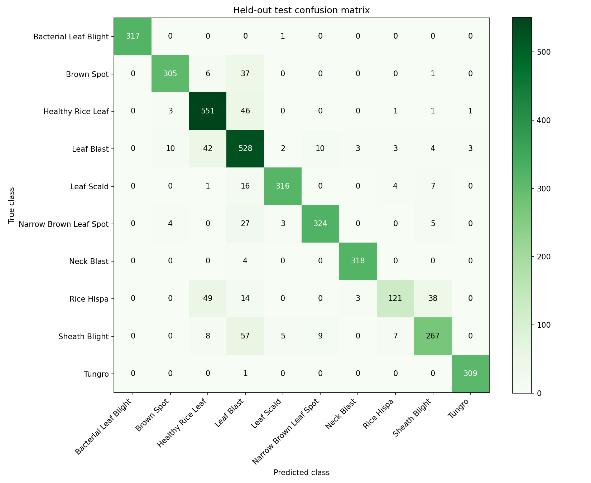

# Rice Leaf Disease Classifier

เว็บ Gradio จำแนกภาพข้าว **10 คลาส** ด้วย SVM พร้อมเปรียบเทียบคะแนนทุกคลาส ภาพที่เตรียมแล้ว การเปรียบเทียบคลาสสองฝั่ง และผลประเมินรายคลาส ทำเฉพาะ **Image Classification** ตามคำขอ โดยอ้างอิงรายการส่งงานใน `Purpose.md` และรูปแบบอัปโหลด/Prediction/Processed image ของ `digit_svm_app`

## แนวคิด ปัญหา และประโยชน์

ใช้ภาพข้าวหนึ่งภาพเป็น input เพื่อทำนายชนิดในชุดข้อมูล เช่นใบปกติ ใบจุดสีน้ำตาล หรือไหม้ใบ ช่วยศึกษาว่าคุณลักษณะสีและ texture แยกคลาสได้เพียงใด และตรวจว่าคลาสใดสับสนกับคลาสใด ผลลัพธ์เป็นชื่อคลาส ไม่ใช่ค่าความรุนแรง ไม่ระบุตำแหน่งโรค และไม่ใช้ยืนยันโรคในแปลง

## ชุดข้อมูลและสิทธิ์ใช้งาน

- แหล่งข้อมูลที่ผู้จัดทำระบุ: [Rice Leaf Diseases Detection — loki4514, Kaggle](https://www.kaggle.com/datasets/loki4514/rice-leaf-diseases-detection)
- Kaggle metadata ระบุ **Apache 2.0** ตรวจวันที่ 30 กันยายน 2026; รายละเอียด attribution/การเผยแพร่อยู่ใน [DATASET.md](DATASET.md)
- ใช้ `Rice_Leaf_Diease/Rice_Leaf_Diease` ซึ่งแบ่ง train/test ไว้แล้ว ชื่อโฟลเดอร์เป็น label
- นำเข้าจาก `Rice Leaf Disease: An Images Dataset` **7,040 ภาพ** ใน Healthy, Leaf Blast และ Sheath Blight พบกลุ่มพิกเซลใหม่ **2,684 กลุ่ม** แบ่งประมาณ 80/20 ต่อคลาสด้วย seed 42 ภาพที่ตรงกับข้อมูลเดิมคง split เดิม (ให้ test มาก่อนหากเดิมซ้ำทั้งสองชุด) ตรวจสำเนาด้วย SHA-256 รายละเอียดทุกไฟล์อยู่ใน `rice_leaf_app/artifacts/more_import_manifest.csv`
- คะแนนหลังเพิ่มข้อมูลใช้ test ที่ขยายแล้ว จึงไม่ควรเทียบกับคะแนนเดิมตรง ๆ; แหล่งภาพเพิ่ม: [Rice Leaf Disease: An Images Dataset — alamshihab075, Kaggle](https://www.kaggle.com/datasets/alamshihab075/rice-leaf-disease-an-images-dataset) ซึ่งผู้ใช้ระบุสำหรับภาพจาก `Rice Leaf Disease: An Images Dataset`; ตรวจ Kaggle metadata วันที่ 30 กันยายน 2026 พบใบอนุญาต **MIT** (แยกจาก Apache 2.0 ของชุดเดิม)

- ภาพทั้งหมด **25,445**: raw train **20,462** / raw test **4,983**
- ใช้จริง **20,640**: train **16,848** / test **3,792**; ตัดออก **4,805** ตาม audit โดยไม่ลบต้นฉบับ
- ไม่รวม `Rice_Leaf_AUG` (11,790 ภาพ / 9 คลาส / ไม่มี Tungro) เพราะไม่มี mapping ภาพ augmented กลับภาพต้นฉบับ
- เก็บ manifest ของทุกภาพและเหตุผลตัดออก; ตรวจ exact decoded RGB duplicates และ label ขัดแย้ง ถ้าข้าม split ตัดสำเนา train ออก
- แบ่ง train เพื่อพัฒนาเป็น fit **13,478** / validation **3,370** แบบ stratified, seed 42; ใช้ validation เลือก C แล้วฝึกโมเดลสุดท้ายบน train ทั้งหมด ไม่ใช้ test เลือกโมเดล

## โมเดลและผลประเมินจริง

RGB 128 × 128 → HSV histograms + local RGB mean/std + gradient orientation histograms รวม **404 features** → StandardScaler → RBF SVM (`C=10.0`, class_weight=balanced)

เลือก SVM เป็น baseline ที่รันบน CPU และอธิบายขั้นตอนสกัดสี/texture ได้ง่าย มีข้อจำกัดกับรอยโรคละเอียดและพื้นหลังที่ต่างจากชุดฝึก `StandardScaler` fit เฉพาะ train และบันทึกพร้อม SVM ใน joblib แอปใช้ preprocessing เดียวกับการฝึก

ผลบน **held-out test 3,792 ภาพ**:

| Metric | Score |
|---|---:|
| Accuracy | 0.8850 (88.50%) |
| **Macro F1 — เมตริกหลัก** | **0.8870** |
| Weighted F1 | 0.8840 |

Accuracy คือสัดส่วนทำนายถูกทั้งหมด; Precision คือสัดส่วนภาพที่ถูกในกลุ่มที่โมเดลทำนายเป็นคลาสนั้น; Recall คือสัดส่วนภาพจริงคลาสนั้นที่ค้นพบ; F1 รวม precision/recall แบบ harmonic mean

Macro F1 เฉลี่ยทุกคลาสเท่ากัน จึงใช้เป็นเมตริกหลักสำหรับการเปรียบเทียบคลาส ส่วน Weighted F1 ให้น้ำหนักตามจำนวนภาพในคลาสนั้น คะแนนโมเดลเป็นค่าประมาณจาก `predict_proba` และใช้ **argmax probability** เป็นผลจำแนกทั้งแอปและรายงาน เพื่อให้กฎทำนายตรงกัน ไม่ใช่เปอร์เซ็นต์ความแน่นอนของโรค

### จำนวนภาพและคะแนนรายคลาส

| Class | Raw train | Raw test | Used train | Used test | Precision | Recall | F1 |
|---|---:|---:|---:|---:|---:|---:|---:|
| bacterial_leaf_blight | 1386 | 376 | 1386 | 318 | 1.000 | 0.997 | 0.998 |
| brown_spot | 1480 | 380 | 1480 | 349 | 0.947 | 0.874 | 0.909 |
| healthy | 3836 | 994 | 2345 | 603 | 0.839 | 0.914 | 0.875 |
| leaf_blast | 4620 | 967 | 2819 | 605 | 0.723 | 0.873 | 0.791 |
| leaf_scald | 1670 | 386 | 1670 | 344 | 0.966 | 0.919 | 0.942 |
| narrow_brown_spot | 1416 | 382 | 1416 | 363 | 0.945 | 0.893 | 0.918 |
| neck_blast | 1000 | 322 | 678 | 322 | 0.981 | 0.988 | 0.985 |
| rice_hispa | 1461 | 225 | 1461 | 225 | 0.890 | 0.538 | 0.670 |
| sheath_blight | 1853 | 641 | 1853 | 353 | 0.827 | 0.756 | 0.790 |
| tungro | 1740 | 310 | 1740 | 310 | 0.987 | 0.997 | 0.992 |


F1 สูงสุดคือ **bacterial_leaf_blight (0.998)** และต่ำสุดคือ **rice_hispa (0.670)** การสับสนที่พบบ่อย (คลาสจริง → คลาสทำนาย):

- `sheath_blight` → `leaf_blast`: **57 ภาพ**
- `rice_hispa` → `healthy`: **49 ภาพ**
- `healthy` → `leaf_blast`: **46 ภาพ**
- `leaf_blast` → `healthy`: **42 ภาพ**
- `rice_hispa` → `sheath_blight`: **38 ภาพ**



แถวเป็นคลาสจริง คอลัมน์เป็นคลาสทำนาย ตัวอย่างข้อผิดพลาดทั้งหมดอยู่ใน `rice_leaf_app/artifacts/errors.csv` พร้อมภาพตัวอย่างถูก/ผิดและการตีความใน notebook การสับสนอาจเกิดจากสี/texture คล้ายกัน พื้นหลัง แสง หรือรอยเล็กหลัง resize ซึ่งต้องตรวจภาพเพิ่มเติมก่อนยืนยันสาเหตุ

### ข้อจำกัด

- ไม่ทราบ source-image/plant/field ID จึงยังอาจมี near duplicates หรือภาพ augmented จากต้นเดียวกันข้ามชุด แม้ตัด exact duplicates แล้ว คะแนนนี้ไม่รับรองการใช้กับแปลงใหม่
- ภาพถูก resize ทั้งเฟรมเป็นสี่เหลี่ยม อัตราส่วนเปลี่ยนได้ และรอยเล็กอาจหาย ไม่มี segmentation
- โมเดลบังคับเลือกหนึ่งใน 10 คลาส ไม่มีตัวตรวจภาพนอกขอบเขต ภาพไม่ใช่ข้าวหรือภาพหลายโรคอาจให้ผลที่ดูมั่นใจแต่ผิด
- ชุดนี้รวม Neck Blast และความเสียหายจากแมลง ไม่ใช่เฉพาะโรคของใบ
- ควรทดสอบกับภาพจากแปลง/ต้นใหม่ และแยกต้นฉบับก่อน augmentation ในการพัฒนาต่อ

## ดาวน์โหลดโครงการและภาพจริงจาก GitHub

ติดตั้ง Git และ Git LFS ก่อน แล้วรัน:

```powershell
git lfs install
git clone https://github.com/NongkaiOne/Rice-Leaf-Disease-Classification.git
cd Rice-Leaf-Disease-Classification
git lfs pull
```

ภาพทั้งหมดเก็บผ่าน Git LFS ต้องดาวน์โหลดไฟล์ภาพจริงก่อนฝึกหรือรัน notebook การดาวน์โหลด ZIP อาจได้เพียง pointer files ทั้งนี้ขึ้นกับการตั้งค่าของ GitHub

## ติดตั้งและรันบนเครื่อง

ใช้ Python **3.12** จาก project root:

```powershell
py -3.12 -m venv .venv
.\.venv\Scripts\python.exe -m pip install -r requirements.txt
.\.venv\Scripts\python.exe app.py
```

เปิด **http://127.0.0.1:7861** สำหรับ Linux/macOS ใช้ `python3.12 -m venv .venv` และ `.venv/bin/python` แทน (เปลี่ยนพอร์ตด้วย environment variable `PORT`)

ใน workspace ที่จัดเตรียมครั้งนี้มี runtime ส่วนตัวที่ไม่ commit เข้า Git ใช้งานทันทีได้ด้วย:

```powershell
.\.runtime\python.exe app.py
```

โหลดเฉพาะไฟล์ joblib ที่เชื่อถือได้ ไฟล์โมเดลที่ส่งมาสร้างจากสคริปต์ในโปรเจกต์นี้ ไม่ต้องฝึกใหม่ทุกครั้งที่เปิดแอป

### ฝึกใหม่และตรวจสอบ

```powershell
.\.venv\Scripts\python.exe -m rice_leaf_app.train_model
.\.venv\Scripts\python.exe -m rice_leaf_app.verify
.\.venv\Scripts\python.exe scripts/build_report.py
```

ถ้าใช้ runtime ที่เตรียมไว้ เปลี่ยน executable เป็น `.\.runtime\python.exe` การฝึกอ่านภาพทั้งหมด อาจใช้เวลาหลายนาทีและจะเขียนทับเฉพาะโมเดล/รายงานที่สร้างขึ้น โดยไม่แก้ภาพต้นฉบับ

เปิด [notebooks/rice_leaf_classification.ipynb](notebooks/rice_leaf_classification.ipynb) ด้วย Jupyter หรือ VS Code เลือก interpreter ที่ติดตั้ง requirements แล้วรันจากบนลงล่าง ค่าเริ่มต้นทบทวนโมเดลบันทึกไว้และคำนวณผล test ใหม่ทั้งหมด ตั้ง `RETRAIN = True` เพื่อฝึกใหม่ใน notebook

## วิธีใช้งานและตัวอย่าง

1. แท็บ **จำแนกภาพ · Classification** อัปโหลด JPG/PNG 1 ภาพ หรือเลือกตัวอย่างด้านล่าง
2. กด **จำแนกภาพ · Classify** ดูชื่อคลาส คะแนนเปรียบเทียบครบ 10 คลาส และภาพ RGB 128 × 128
3. แท็บ **เปรียบเทียบคลาส · Class Comparison** เลือกคลาสสองฝั่งเพื่อเทียบภาพ จำนวน train/test, precision, recall, F1 และจำนวนที่ทำนายสับสนกัน
4. แท็บ **ผลประเมิน · Evaluation** ดูคะแนนรวม ตารางรายคลาส และ confusion matrix

ภาพตัวอย่างใช้จาก test อย่างละคลาสใน `rice_leaf_app/examples/` เป็นภาพที่ย่อเพื่อแสดงผล ไม่ใช่ข้อมูลเพิ่มสำหรับฝึก และคะแนนตัวอย่างย่ออาจต่างเล็กน้อยจากภาพต้นฉบับในการประเมิน

## เผยแพร่และ URL สำหรับส่งงาน

- **GitHub repository: [https://github.com/NongkaiOne/Rice-Leaf-Disease-Classification](https://github.com/NongkaiOne/Rice-Leaf-Disease-Classification)**
- **Public Gradio App: ยังไม่ได้เผยแพร่ — ยังไม่มี public URL**
- Local URL `http://127.0.0.1:7861` ใช้เฉพาะเครื่องนี้ ไม่ใช่ลิงก์ส่งผู้สอน

เตรียม `app.py`, requirements แบบ pin version, model และ README metadata สำหรับ Hugging Face Spaces แล้ว สร้าง Space แบบ **Gradio / Python 3.12** และอัปโหลด `app.py`, `requirements.txt`, `README.md`, `DATASET.md`, license และ `rice_leaf_app/` ทั้งโฟลเดอร์ โดยไม่ต้องอัปโหลด dataset เต็มเพื่อรัน inference แอปรันจากโมเดลที่ฝึกจริง

สำหรับโฮสต์ Docker มี `Dockerfile` เปิดพอร์ต 7860 และตั้ง GRADIO_SERVER_NAME=0.0.0.0; ยังไม่ได้ทดสอบ build/deploy บนโฮสต์จริง

เก็บ dataset เต็มบน GitHub ตาม Purpose.md ด้วยวิธีที่รองรับขนาดข้อมูล เช่น Git LFS แล้วตรวจสิทธิ์ผู้สอนและการดาวน์โหลดภาพจริง ใช้ [DATASET.md](DATASET.md) กำกับที่มา/สิทธิ์และเก็บ license upstream เติม URL จริงสองรายการด้านบนหลัง deploy และตรวจใน browser ที่ไม่ได้ล็อกอิน โดยให้บริการพร้อมในช่วงตรวจงาน ไม่ใช้ `share=True` ชั่วคราวแทน hosting ถาวร

## โครงสร้างสำคัญ

| Path | หน้าที่ |
|---|---|
| `app.py` | จุดเริ่ม Gradio ในเครื่องและบนโฮสต์ |
| `rice_leaf_app/app.py` | หน้าอัปโหลด เปรียบเทียบคลาส ผลประเมิน และวิธีใช้ |
| `rice_leaf_app/preprocessing.py` | การเตรียมภาพและสกัด 404 features ร่วมกัน |
| `rice_leaf_app/dataset.py` | ตรวจข้อมูลและภาพซ้ำ พร้อม manifest |
| `rice_leaf_app/train_model.py` | เลือก C จาก validation ฝึก ประเมิน และบันทึกโมเดล |
| `rice_leaf_app/inference.py` | โหลดโมเดลและคำนวณคะแนน |
| `rice_leaf_app/models/rice_classifier.joblib` | scaler + SVM ที่ฝึกจริงและ metadata |
| `rice_leaf_app/artifacts/` | manifests, metrics, predictions, errors, plots |
| `rice_leaf_app/examples/` | ภาพตัวอย่าง 10 คลาส |
| `notebooks/rice_leaf_classification.ipynb` | notebook พร้อมคำอธิบายและผลรัน |
| `Rice_Leaf_Diease/Rice_Leaf_Diease/` | dataset ที่ใช้ train/test พร้อม labels |
| `requirements.txt` | เวอร์ชันแพ็กเกจสำหรับติดตั้ง |
| `STATUS.md` | รายการทำแล้ว/ยังไม่เสร็จตาม Purpose.md |

## ผู้จัดทำ

| รหัสนิสิต | ชื่อ–นามสกุล |
|---|---|
| 6730300213 | นายธนภัทร สีบุตดา |
| 6730300246 | นางสาวพัชญ์ปณดา ชัยเกตุธนพัฒน์ |
| 6730300299 | นางสาวน้ำพระทัย สาระกูล |
| 6730300868 | นายพัศสพล ราตรีวิจิตร์ |

## เอกสารเทคนิคอ้างอิง

- [Gradio Blocks](https://www.gradio.app/docs/gradio/blocks)
- [scikit-learn SVC](https://scikit-learn.org/stable/modules/generated/sklearn.svm.SVC.html)
- [Hugging Face Spaces configuration](https://huggingface.co/docs/hub/spaces-config-reference)
